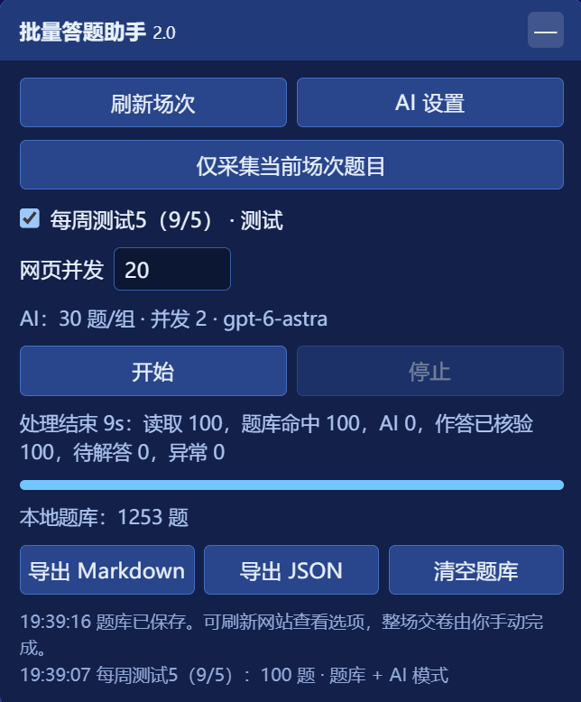
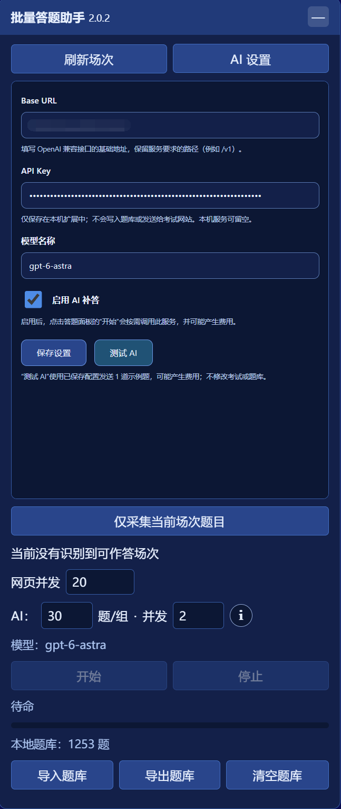

# 模拟训练批量答题助手

适用于 `exam.asname.cn` 的 Chrome / Edge 扩展。自动识别当前开放的知识练习和测试；优先使用网站返回的官方答案及本地题库，缺失答案可交给自己配置的 AI，并把题目和答案持续保存到同一份题库。

当前版本：**2.0.2**。

- 自动识别当前可作答场次，用户勾选后开始。
- 官方答案、本地题库、AI 补答依次使用，答案保存后回读核验。
- AI 服务、每组题数和并发数均可配置。
- JSON 题库导入合并去重，Markdown / JSON 统一从导出菜单选择。

## 安装

1. 下载 [exam-asname-autofill.zip](exam-asname-autofill.zip)（点进去后右侧「Download raw file」），解压到任意位置
2. Chrome 地址栏输入 `chrome://extensions/`，打开右上角「开发者模式」
3. 点左上角「加载已解压的扩展程序」，选择解压出的 `exam-asname-autofill` 文件夹（选文件夹本身，不要进去选文件）
4. 打开 `https://exam.asname.cn/` 并登录，右下角出现面板

Edge 同理，扩展页地址为 `edge://extensions/`。解压后的文件夹不要删除或移动，删了扩展就失效。

出现「未找到登录凭证」时，登录后刷新页面。更新版本时，在扩展管理页重新加载扩展，再刷新考试网页。

## 共享题库

仓库的 [`question-bank/`](question-bank/) 文件夹提供作者于 **2026-09-05** 导出的 **1253 题**题库，两种格式对应同一批题目：

| 格式 | 用途 | 文件 |
| --- | --- | --- |
| JSON | 在扩展中导入，自动匹配答案 | [下载 JSON 题库](https://github.com/Meridian-lIzix/exam-asname-autofill/raw/refs/heads/main/question-bank/题库-2026-09-05.json) |
| Markdown | 在 GitHub 或本地阅读复习 | [查看 Markdown 题库](question-bank/题库-2026-09-05.md) |

初次使用时，先下载 JSON 文件，再点击面板底部的「导入题库」并选择该文件。已有本地题库时会自动合并去重，无需先清空。Markdown 文件用于阅读，不能直接导入。

这份题库是上述日期的记录，未覆盖的新题仍会按题库与 AI 补答流程处理。

## 使用

1. 登录后点击「刷新场次」。列表仅显示接口实际返回、当前开放、尚未交卷且能识别的选择题场次；过期、未开放及无法识别的场次不显示。每 30 秒自动刷新，开始前会再次核实。
2. 勾选要处理的场次，按需调整网页并发和 AI 分组参数，含义见下表。
3. 点击「开始」。已知答案直接匹配；测试中找不到答案的题，启用 AI 后才发送给模型。未启用 AI 或调用失败的题保留在题库中，显示为待解答。
4. 处理结束后手动刷新网页查看作答。扩展逐题提交后会回读核验，不会自动最终交卷。测试不返回官方答案时，核验表示网站保存了预期选项，不代表答案一定正确。

「停止」会停止派发新任务并取消 AI 请求，已获得的答案保留；重新运行会优先复用题库。不要在多个页面同时开始答题。

结束统计中的「网站答案」是本轮由网站返回的官方答案数量，「题库命中」包含以前保存到本场次的答案和从其他场次匹配到的答案，「AI」是本轮新获取的 AI 答案数量。重复运行时复用已保存的 AI 答案，也计入题库命中，不计为本轮 AI 答案；「作答已核验」单独表示网站保存状态已核对。

下图为 2.0 版本的一次实际运行：读取 100 题，全部命中题库，因此 AI 调用题数为 0。当前版本已更新统计项和底部按钮布局。

## 并发与分组

| 设置 | 含义 | 默认值 | 可选范围 |
| --- | --- | --- | --- |
| 网页并发 | 同时向考试网站发出的请求数，用于读取题目、保存选项和回读核验 | 5 | 1～20 |
| AI 题/组 | 每次 AI 请求最多包含的题目数 | 30 | 1～100 |
| AI 并发 | 同时发送给 AI 的题目组数 | 2 | 1～10 |

**最多同时处理题数＝每组题数 × AI 并发组数。** 例如设置 40 题/组、并发 2，最多同时处理 80 题；其余题目自动排队，任意一组完成后立即处理下一组。整场题数不受这个乘积限制，网页并发也不会改变 AI 并发。

AI 两项参数修改后自动保存，运行期间不可修改。鼠标停在旁边的「i」上或用键盘聚焦，即可查看说明。建议从 30 题/组、并发 2 开始；长题或输出不完整时降低每组题数，服务限流时降低并发。

## AI 设置

在浮动面板点击「AI 设置」，填写 OpenAI Chat Completions 兼容服务的 Base URL、API Key 和模型名称，勾选「启用 AI 补答」后保存，并允许扩展访问该服务。

2.0.2 配置面板如下，截图中的服务地址已遮挡，API Key 以密码形式显示：

保存设置和「测试 AI」不受考试开放时间限制，也可以从扩展管理页打开本扩展的设置页操作。若提示后台仍是旧版本，需要先在扩展管理页重新加载，再刷新考试网页，仅刷新网页不会更新已运行的后台。

Base URL 保留服务要求的路径，例如 `https://api.example.com/v1`；远程接口必须使用 HTTPS，本机 `localhost` / `127.0.0.1` 服务可以使用 HTTP。模型名称使用服务实际提供的 ID。

保存后可点击「测试 AI」，通过 1 道固定示例题验证接口、返回题号和选项格式，并显示模型及耗时。测试使用已保存的配置，可能产生少量调用费用，不会修改考试答案或题库；即使所有考试题都命中题库，也能单独测试 AI。通过示例题不代表真实考试答案一定正确。

配置保存在本机扩展存储，面板通过独立的扩展设置页输入密钥。AI Key 不进入网站存储或题库导出。启用后，只向所配置的服务发送待解答题目的题号、题型、题干和选项，调用可能产生服务费用。

模型按题号返回 JSON，扩展校验题号、选项范围和单多选数量，再按选项内容对应网站当前顺序。乱序返回不会按位置串题；漏题或非法答案会重试一次，仍失败的题保持待解答。格式正确不保证模型知识判断正确。

## 题库与采集

底部按钮为「导入题库」「导出题库」「清空题库」。「导出题库」在按钮正上方居中打开菜单，选择 Markdown 生成带选项标记的复习资料，选择 JSON 生成可再次导入的结构化题库。

「导入题库」支持本扩展导出的 JSON 文件，包括旧版题库。没有本地题库时直接导入；已有题库时自动合并，题型、题干及选项内容相同的题目只保留一条，选项换序不影响去重。官方答案优先于 AI 答案，未解答记录不会覆盖已有答案。文件格式错误或同一题存在同等来源的答案冲突时，停止本次导入并保留原题库。

题库沿用原有 `localStorage` 存储，跨场次、跨多次运行累积；相同题干、题型及选项内容可复用答案，选项换序时自动重新对应。

AI 来源在导出题干末尾标注 `（AI作答）`，原始题干用于匹配。官方答案优先于 AI 答案。AI 答案即使提交失败也会保留，并记录作答是否核验成功。清空题库前请先导出需要保留的资料。

「仅采集当前场次题目」读取当前页面对应的场次和题目，下载 `场次采集-…json`，并保留一份浏览器中的采集记录；不作答、不调用 AI。此文件用于核对网站真实数据结构，与普通「导出 JSON」的历史题库不同。该功能需要在场次仍可访问时使用。

## 练习与测试的区别

已识别的知识练习继续使用原有流程：读取题目，对未答题作答后重新读取 `r_answer`，再校正答案。测试不会通过随便选择一个选项来探测答案；官方答案缺失时先查题库，再按需调用 AI。场次模式结合接口返回的名称、分组信息、类型及开放时间识别，不只根据页面 URL 判断。

网站登录凭证在请求时从 `sessionStorage` 读取，仅用于原站接口，不发送给 AI 服务。扩展不会调用最终交卷接口。

## 开发验证

扩展运行不依赖第三方库，也不需要构建。安装 Node.js 后，可运行 `node --test tests/*.test.cjs` 检查场次过滤、题库匹配、AI 分组与响应校验、后台权限及提交回读逻辑。模拟测试不等同于真实服务验证，首次配置 AI 后应检查实际调用结果。

`tests/browser-flows.cjs`、`tests/settings-flow.cjs` 和 `tests/import-flows.cjs` 验证模拟页面流程，需要另行安装开发验证依赖 `jsdom`；可将它安装到独立目录并通过 `NODE_PATH` 指定，再使用 Node.js 运行这些脚本，不影响扩展安装包。

## 许可

MIT，仅供学习用途。
