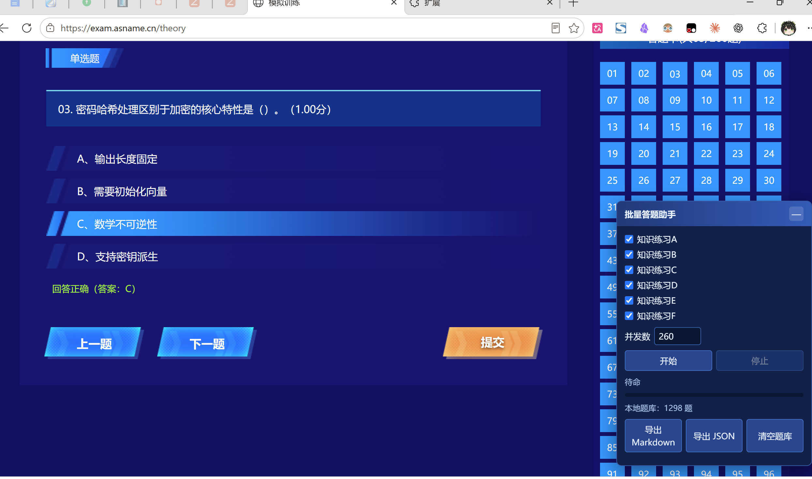

# 模拟训练批量答题助手

`exam.asname.cn` 知识练习的 Chrome 扩展：批量把每题作答校正为正确答案，并把题干、选项、答案导出成复习资料。全部在本地运行。



## 安装

1. `chrome://extensions/` → 开启「开发者模式」
2. 「加载已解压的扩展程序」→ 选择本文件夹
3. 打开 `https://exam.asname.cn/` 并登录，右下角出现面板

## 使用

勾选场次 → 设置并发数 → 「开始」。跑完自动刷新页面，每题显示为「回答正确」并高亮正确选项，可直接截图。

「导出 Markdown」得到带 ✅ 标注的复习资料，「导出 JSON」得到结构化题库。题库存在 `localStorage`，跨场次、跨多次运行累积去重。

## 原理

接口 `POST /api/assessment/assessmentmain` 只在题目作答过之后才在 `select` 响应里返回 `r_answer`，且 `add` 可重复覆盖作答。每场按四阶段并发推进：

```
读取  select 全部题目        → 已答过的直接拿到 r_answer
探针  对未作答的题 add("A")
回读  再 select              → 取得 r_answer
校正  对 作答 ≠ 答案 的题 add(正确答案)
```

已正确的题在「读取」阶段就被排除，不产生写请求，因此重复运行幂等，中断后重跑只补未完成部分。

登录凭证从 `sessionStorage` 按 `eyJ` 前缀定位，扩展不存储凭证。已交卷的场次会被跳过并继续处理其余场次。

## 许可

MIT，仅供学习用途。
